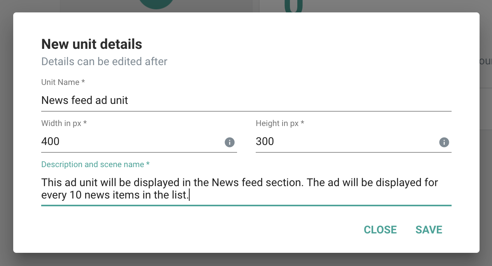

In this section we are going to see how to integrate GreedyGame Native Ads in Android native projects.

### **Importing GreedyGame Native Ads SDK**

Games built with Android Studio can easily integrate with <a target="_blank" rel="noopener noreferrer" href="https://gradle.org">Gradle</a>.

**Add the following to the app level** `build.gradle`. (excerpt)

```gradle hl_lines="6"
dependencies {
    implementation fileTree(dir: 'libs', include: ['*.jar'])
    implementation 'com.android.support:appcompat-v7:26.1.0'
    ...............
    //greedygame sdk
    implementation 'com.greedygame:greedygame:8.8.16'
}
```

### **Dependency Libraries**
Include the following in the `app` level `build.gradle`. (excerpt)
```gradle
implementation 'com.google.android.gms:play-services-ads:16.0.0'
implementation 'com.google.android.gms:play-services-location:16.0.0' //Recommended but optional
```
GreedyGame SDK has been tested to work correctly with 16.x series of the Google Play Services. Support for future versions is experimental.

### **Update your AndroidManifest.xml**

Add the following `<activity>` declaration inside `<application>` tag of the Manifest.
```xml
<activity
   android:name="com.greedygame.android.core.campaign.uii.web.GGWebActivity"
   android:configChanges="keyboardHidden|orientation|screenSize|screenLayout|layoutDirection"
   android:hardwareAccelerated="true"
   android:launchMode="singleTask"
   android:screenOrientation="landscape"
   android:theme="@style/Theme.GGTransparent"/>

<activity
   android:name="com.greedygame.android.core.mediation.greedygame.GGS2SActivity"
   android:configChanges="keyboardHidden|orientation|screenSize|screenLayout|layoutDirection"
   android:hardwareAccelerated="true"
   android:launchMode="singleTask"
   android:screenOrientation="landscape"
   android:theme="@style/Theme.GGTransparent"/>

<activity
   android:name="com.greedygame.android.core.mediation.admob.GGAdMobActivity"
   android:configChanges="keyboardHidden|orientation|screenSize|screenLayout|layoutDirection"
   android:hardwareAccelerated="true"
   android:launchMode="singleTask"
   android:screenOrientation="landscape"
   android:theme="@style/Theme.GGTransparent"/>

```

Also, note the highlighted line where you can change the orientation of the `screenOrientation` property based on which orientation you want to open the engagment. All the allowed values can be found in <a target="_blank" rel="noopener noreferrer" href="https://developer.android.com/guide/topics/manifest/activity-element#screen">Android Documentation</a>.

### **Adding Permissions**

GreedyGame SDK needs the following permissions to work with.

**Recommended permissions**

```xml
<uses-permission android:name="android.permission.ACCESS_NETWORK_STATE"/>
<uses-permission android:name="android.permission.ACCESS_WIFI_STATE"/>
<uses-permission android:name="android.permission.INTERNET"/>
<uses-permission android:name="android.permission.ACCESS_COARSE_LOCATION"/>
```

!!! tip
    `ACCESS_COARSE_LOCATION` permission will help improving the revenue because of doing better ad targetting.
    
### **Creating Ad Units**
Adunits are ad assets that are rendered as a native component to the app.

**Follow the below steps to create an Ad Unit ID.**

* Goto **<a target="_blank" rel="noopener noreferrer" href="https://integration.greedygame.com">Integration Panel</a>**
* Select an App you have created previously.
* Click on **`Create Unit`** inside the **`Ad units in app`** Card.
* Enter all the fields and click **`Save`**.



Follow the same procedure to create multiple Ad Units inside the app.

!!! note ""
    Best practices about the Unit Dimensions can be found under **<a target="_blank" rel="noopener noreferrer" href="/best_practices/#creating-units">Best Practices</a>** section.


### **Initializing GreedyGameAgent**

`GreedyGameAgent` is the entry point to fetching Native Ads from GreedyGame SDK. Create `GreedyGameAgent` instance in the `onCreate` of the Activity.

```Java tab=
GreedyGameAgent greedyGame = new GreedyGameAgent.Builder(activity)
    .setGameId(GAME_ID_CREATED) //e.g 00100100
    .addUnitId(ADUNIT_CREATED) //e.g slot-1000
    .addUnitId(ADUNIT_CREATED) //e.g slot-1002
    .enableAdmob(true)
    .withAgentListener(new CampaignStateListener() {
        @Override
        public void onUnavailable() {

        }

        @Override
        public void onAvailable(String campaignId) {

        }

        @Override
        public void onError(String error) {

        }
    })
    .build();
```

<!-- 
```Java tab="Kotlin"
val GreedyGameAgent = GreedyGameAgent.Builder(activity)
    .appId(APP_ID_CREATED) //e.g 00100100
    .addUnitId(ADUNIT_CREATED) //e.g slot-1000
    .addUnitId(ADUNIT_CREATED) //e.g slot-1002
    .withAgentListener(object: CampaignStateListener() {

        override fun onUnavailable() {

        }

        override fun onAvailable(advId: String) {

        }

        override fun onError(error: String) {

        }
    })
    .build()
``` 
-->

### **CampaignStateListener methods**

| Methods      | Definition                                      |
| ------------ | ----------------------------------------------- |
| `onAvailable(campaignId)`  | SDK fetched an ad|
| `onUnavailable()`    | Failed to fetch next ad                          |
| `onError(error)`     | SDK not able to initialize. Check the `error` message.|

## **Load an Ad**
To load Native Ads call the `init()` method from `GreedyGameAgent` instance created before.

```Java tab= hl_lines="6"
GreedyGameAgent greedyGame = new GreedyGameAgent.Builder(activity)
    .setGameId(GAME_ID_CREATED) //e.g 00100100
    .addUnitId(ADUNIT_CREATED) //e.g slot-1000
     ---"other builder methods"---
    .build();
greedyGame.init();
```

<!-- ```Java tab="Kotlin" hl_lines="6"
val greedyGame = GreedyGameAgent.Builder(activity)
    .appId(APP_ID_CREATED) //e.g 00100100
    .addUnitId(ADUNIT_CREATED) //e.g slot-1000
     ---"other builder methods"---
    .build()
greedyGame.load()
```
 -->
!!! tip "When to load the GreedyGame's Native Ad?"
    Load the ads by calling `GreedyGameAgent.init()` as early as possible to get the benefits of getting an Ad early. An ideal place would be to call this on `onCreate()` method of `Splash screen` of the game or `Menu screen` of the game.

Once `init()` method called GreedyGame SDK will fetch ads from directly from GreedyGame's demand or it will fetch from any of the Mediation's enabled.

<!-- ## **Destroy Ad**

When you are done with the ads and do not want to display it call `destroy()` on `GreedyGameAgent` instance.

```Java tab=
greedyGame.destroy();
```
 -->
<!-- ```java tab="Kotlin"
greedyGame.destroy()
``` -->

<!-- Detroying ads will automatically remove the Ads created with `NativeAdView`. You can also register for Ad destroy events by the following way.

```Java tab=
greedyGame.setAdDestroyListener(new AdDestroyListener() {
    @Override
    public void onDestroy() {

    }
});
```
 -->
<!-- 
```java tab="Kotlin"
greedyGame.setAdDestroyListener(object: AdDestroyListener() {
    override fun onDestroy() {

    }
});
```
 -->

### **Refresh Ads**

You should refresh the ads that are shown, during natural pauses in your gameflow. Typical examples would include the game pause menu, user trying to restart a level or move to another level, death of a character etc. This will help maximise your revenue and also blend in seamlessly to the gamer. GreedyGame SDK by default doesn’t refresh the ads in between a session. For this you need to call the following API.

```java
agent.startEventRefresh();
```
This will give a callback at the same CampaignStateListener set earlier and the flow would happen as earlier. The units should be properly updated on both `onAvailable()` and `onUnavailable()` callbacks.

!!! warning

    There is a 60 second minimum threshold applied to this API. This means that if this API gets called again within 60 seconds of the previous call, it is ignored.

### **Custom Rendering Native Ads**
Custom rendering allows you to render Native Ads by fetching the image's local path and rendering it with your own `ImageView`.
Follow the example to do the same.

**To fetch the Ad**

To fetch the Ad for a unit you need to call `getPath(unitId)` in `GreedyGameAgent` instance.

```Java tab=
String unitId = "YOUR FLOAT UNIT HERE";
ImageView iv = new ImageView(context);
View.OnClickListener unitClick = new View.OnClickListener() {
    @Override
    public void onClick(View v) {
        agent.showUII(unitId);
    }
}

boolean bitmapChanged = false;
String path = agent.getPath(unitId);
if (path != null) {
   File file = new File(path);
   if (file.exists()) {
       Bitmap bm = BitmapFactory.decodeFile(file.getAbsolutePath());
       if (bm != null) {
           // Use it on your element which needs to be branded.
           bitmapChanged = true;
           iv.setImageBitmap(bm);
           iv.setOnClickListener(unitClick);
       }
   }
}

if(!bitmapChanged) {
   // Change the asset to original or default texture
   iv.setImageBitmap(originalBitmap);
   iv.setOnClickListener(null);
}
```

<!-- ```Java tab="Kotlin"
val adUnitIV = ImageView(context) // AdUnit ImageView to render ad
// Game logics
val unitPath = greedyGame.getPath(ADUNIT_CREATED)
if(unitPath.isNotEmpty()) {
    // GreedyGameAgent has an ad that can be rendered for this Unit id.
    val adBitmap = BitmapHelper.getBitmap(unitPath)
    adUnitIV.bitmap = adBitmap
} else {
    // GreedyGame does not have a valid Ad for this Unit id at the moment
}
``` -->

!!! warning
    
    It's the publisher responsibility to call `getPath(unitId)` at relevant places to render the ads. For example, in `onAvailable()` callback of the `CampaignStateListener` or when you are changing the `Activity`, calling `getPath(unitId)` at the start of the activity will help you display the ad correctly


## **AdMob Mediation support**
GreedyGame SDK can source Ads from GreedyGame directly or it can also fetch demand from `Admob` also.

To enable `Admob Mediation` call `enableAdmob(true)` on the `GreedyGameAgent.Builder` instance.

```Java tab= hl_lines="4"
GreedyGameAgent greedyGame = new GreedyGameAgent.Builder(activity)
    .setGameId(GAME_ID_CREATED) //e.g 00100100
    .addUnitId(ADUNIT_CREATED) //e.g slot-1000
    .enableAdmob(true)
     ---"other builder methods"---
    .build();
greedyGame.init();
```

<!-- ```Java tab="Kotlin" hl_lines="4"
val greedyGame = GreedyGameAgent.Builder(activity)
    .appId(APP_ID_CREATED) //e.g 00100100
    .addUnitId(ADUNIT_CREATED) //e.g slot-1000
    .enableAdmob(true)
     ---"other builder methods"---
    .build()
greedyGame.load()
``` -->

## **Compliance with GDPR**
To enable GDPR privacy settings for GreedyGame's Native Android SDK you can create the instance of `PrivacyOptions` and passing it to `GreedyGameAgent` insance before calling `init()`.

```Java tab=
// Before calling init from the GreedyGameAgent instance you have to set the NPA.
PrivacyOptions privacyOptions = new PrivacyOptions();
privacyOptions.setGgNpa(true);
agent.withPrivacyOptions(privacyOptions);
agent.init();
```

<!-- ```Java tab="Kotlin"
// User has given a consent to protect their privacy
val privacyOptions = PrivacyOptions(true) // By passing true means that the User has given consent to protect their privacy.
greedyGame.withPrivacyOptions(privacyOptions)
greedyGame.load()
```
 -->
!!! note
    Load GreedyGameAgent only after the user has given the consent. If `init()` is called before receiving the consent then the current app session will be considered as a consent of using privacy information. 

    Admob's SDK will also receive the Consent passed from you in case if you are using `Admob Mediation`.

## **Compliance with COPPA**

To enable COPPA filter in GreedyGame's Native Android SDK you can enable it by calling the method `enableCoppa(true)` in `GreedyGameAgent.Builder` instance.

```Java tab= hl_lines="4"
GreedyGameAgent greedyGame = new GreedyGameAgent.Builder(activity)
    .setGameId(GAME_ID_CREATED) //e.g 00100100
    .addUnitId(ADUNIT_CREATED) //e.g slot-1000
    .enableCoppa(true)
     ---"other builder methods"---
    .build();
```
<!-- 
```Java tab="Kotlin" hl_lines="4"
val greedyGame = GreedyGameAgent.Builder(activity)
    .appId(APP_ID_CREATED) //e.g 00100100
    .addUnitId(ADUNIT_CREATED) //e.g slot-1000
    .enableCoppa(true)
     ---"other builder methods"---
    .build()
```
 -->
## **Test Ads**

Now you have successfully integrated with GreedyGame Native Ads now is the time to test the integration.

GreedyGame recommends an easy way to test the ads by following the below steps

* Goto **<a target="_blank" rel="noopener noreferrer" href="https://integration.greedygame.com">Integration Panel</a>**
* Select an App in which you want to check the test ads.
* Click `SCAN QR` under the test Ads section and follow the stpes mentioned to get the test ads.
