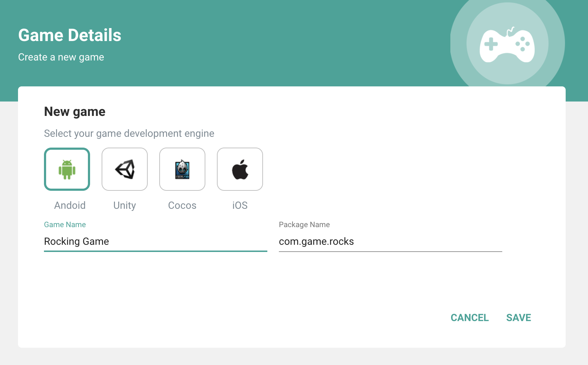
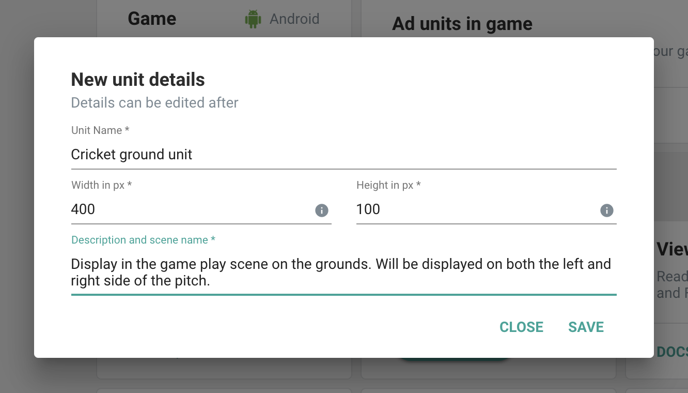

In this section we are going to see how to integrate GreedyGame Native Ads in Android native projects.

### **Importing GreedyGame Native Ads SDK**

Games built with Android Studio can easily integrate with [Gradle](https://gradle.org).

**Add the following to the app level** `build.gradle`. (excerpt)

```gradle hl_lines="6"
dependencies {
	implementation fileTree(dir: 'libs', include: ['*.jar'])
	implementation 'com.android.support:appcompat-v7:26.1.0'
	...............
	//greedygame sdk
	implementation 'com.greedygame:core:9.0.0'
}
```

### **Dependency Libraries**
Include the following in the `app` level `build.gradle`. (excerpt)
```gradle
implementation 'com.google.android.gms:play-services-ads:16.0.1'
implementation 'com.squareup.moshi:moshi:1.8.0'
```

### **Update your AndroidManifest.xml**

Add the following `<activity>` declaration inside `<application>` tag of the Manifest.
```xml hl_lines="6"
<activity
    android:name="com.greedygame.android.core.campaign.uii.GreedyGameActivity"
    android:configChanges="keyboardHidden|orientation|screenSize|screenLayout|layoutDirection"
    android:hardwareAccelerated="true"
    android:launchMode="singleTask"
    android:screenOrientation="portrait"
    android:theme="@style/Theme.GGTransparent">
</activity>
```

Also, note the highlighted line where you can change the orientation of the `screenOrientation` property based on which orientation you want to open the engagment. Allowed values can be found in [Android Documentation](https://developer.android.com/guide/topics/manifest/activity-element#screen).


### **Adding Permissions**

GreedyGame SDK needs the following permissions to work with.

**Mandatory permissions**

```xml
<uses-permission android:name="android.permission.ACCESS_NETWORK_STATE"/>
<uses-permission android:name="android.permission.ACCESS_WIFI_STATE"/>
<uses-permission android:name="android.permission.INTERNET"/>
```

**Optional permissions**

```xml
<uses-permission android:name="android.permission.ACCESS_COARSE_LOCATION"/>
<uses-permission android:name="android.permission.WRITE_EXTERNAL_STORAGE"/>
```

!!! tip
    `ACCESS_COARSE_LOCATION` permission will help improving the revenue because of better ad targeting.

### **Creating Game ID**
Game ID is an unique identifier for your game.

**Follow the below steps to create a Game ID.**

* Goto [https://integration.greedygame.com](https://integration.greedygame.com).
* Login with your GreedyGame's Publisher account.
* Click on **`Games`** menu from the side nav.
* Click on the **`Add Game`** button from the popup model.
* Select the **`Android`** Platform.
* Enter **`Game name`** and **`Package name`** of the game.
* Click on **`SAVE`**.



Once the game is successfully created you will be taken to `Game Details` page where you can see the game related metrics like `Ad requests`, `Impression` and `Clicks`.

### **Creating Ad Units**
Adunits are ad assets that are rendered as a native component to the game.

**Follow the below steps to create an Ad Unit ID.**

* Goto **[Integration panel](https://integration.greedygame.com)**.
* Select a Game you have created previously.
* Click on **`Create Unit`** inside the **`Ad units in game`** Card.
* Enter all the fields and click **`Save`**.



Follow the same procedure to create multiple Ad Units inside the game.

!!! note ""
    Best practices about the Unit Dimensions can be found under **[Best Practices](http://127.0.0.1:8000/best_practices/)** section.

### **Initializing GreedyGameAds**

`GreedyGameAds` is the entry point to fetching Native Ads from GreedyGame SDK. Create `GreedyGameAds` instance in the `onCreate` of the Activity.

```Java tab=
GreedyGameAds greedyGame = new GreedyGameAds.Builder(activity)
    .gameId(GAME_ID_CREATED) //e.g 00100100
    .addUnitId(ADUNIT_CREATED) //e.g slot-1000
    .addUnitId(ADUNIT_CREATED) //e.g slot-1002
    .withAdListener(new AdListener() {
        @Override
        public void onUnavailable() {

        }

        @Override
        public void onAvailable(@NotNull String adId) {

        }

        @Override
        public void onError(@NotNull String error) {

        }
    })
    .build();
```                        

```Java tab="Kotlin"
val greedyGameAds = GreedyGameAds.Builder(activity)
    .gameId(GAME_ID_CREATED) //e.g 00100100
    .addUnitId(ADUNIT_CREATED) //e.g slot-1000
    .addUnitId(ADUNIT_CREATED) //e.g slot-1002
    .withAdListener(object: AdListener() {

        override fun onUnavailable() {

        }

        override fun onAvailable(advId: String) {

        }

        override fun onError(error: String) {

        }
    })
    .build()
```

### **AdListener methods**

| Methods      | Definition                                      |
| ------------ | ----------------------------------------------- |
| `onAvailable(adId)`  | SDK fetched an ad|
| `onUnavailable()`    | Failed to fetch next ad                          |
| `onError(error)`     | SDK not able to initialize. Check the `error` message.|

### **Rendering Native Ads**
To render Native Ads add the `NativeAdView` inside any of the activity in which you want to show Native Ads.

```XML tab=
<RelativeLayout>
    ----------
    other views
    ----------
    <com.greedygame.android.adview.NativeAdView
            android:id="@+id/ggad"
            app:unitId="ADUNIT_CREATED"
            android:layout_width="match_parent"
            android:layout_height="150dp"/>
    ----------
    other views
    ----------
</RelativeLayout>
```

```Java tab=
NativeAdView nativeAdView = new NativeAdView(this, ADUNIT_CREATED);
LinearLayout.LayoutParams params = new LinearLayout.LayoutParams(LinearLayout.LayoutParams.MATCH_PARENT, AD_UNIT_SIZE_IN_PIXELS);
LinearLayout linearLayout = (LinearLayout) findViewById(R.id.parent);
linearLayout.addView(nativeAdView, params);
```

```Java tab="Kotlin"
val nativeAdView = NativeAdView(this, ADUNIT_CREATED)
val params = LinearLayout.LayoutParams(LinearLayout.LayoutParams.MATCH_PARENT, AD_UNIT_SIZE_IN_PIXELS)
val linearLayout = findViewById(R.id.parent) as? LinearLayout
linearLayout?.addView(nativeAdView, params)
```

!!! info
    The advantage of integrating GreedyGame Native Ads is that we handle Ads refresh based on the value **`Refresh time`** set in the Integration Panels **`Edit Game`** section. Also, by integrating via `NativeAdView` GreedyGame sdk handles `Click` and `Applying Ads` itself.

## **NativeAdView events**
To get NativeAdView events register for `AdViewListener` by the following way.

```Java tab=
final NativeAdView nativeAdView = (NativeAdView) findViewById(R.id.ggad);
nativeAdView.setAdViewListener(new NativeAdView.AdViewListener() {
    @Override
    public void onImpression() {
        Log.d(TAG, "Impression fired for unit id: " + nativeAdView.getUnitId());
    }
});
```

```java tab="Kotlin"
val nativeAdView = findViewById(R.id.ggad) as NativeAdView
nativeAdView.adViewListener = object: NativeAdView.AdViewListener() {
    override fun onImpression() {
        Log.d(TAG, "Impression fired for unit id: " + nativeAdView.unitId);
    }
}
```

## **Load an Ad**
To load Native Ads call the `load()` method from `GreedyGameAds` instance created before.

```Java tab= hl_lines="6"
GreedyGameAds greedyGame = new GreedyGameAds.Builder(activity)
    .gameId(GAME_ID_CREATED) //e.g 00100100
    .addUnitId(ADUNIT_CREATED) //e.g slot-1000
     ---"other builder methods"---
    .build();
greedyGame.load();
```

```Java tab="Kotlin" hl_lines="6"
val greedyGame = GreedyGameAds.Builder(activity)
    .gameId(GAME_ID_CREATED) //e.g 00100100
    .addUnitId(ADUNIT_CREATED) //e.g slot-1000
     ---"other builder methods"---
    .build()
greedyGame.load()
```

!!! tip "When to load the GreedyGame's Native Ad?"
    Load the ads by calling `GreedyGameAds.load()` as early as possible to get the benefits of getting an Ad early. An ideal place would be to call this on `onCreate()` method of `Splash screen` of the game or `Menu screen` of the game.

Once `load()` method called GreedyGame SDK will fetch ads from directly from GreedyGame's demand or it will fetch from any of the Mediation's enabled.

## **Destroy Ad**

When you are done with the ads and do not want to display it call `destroy()` on `GreedyGameAds` instance.

```Java tab=
greedyGame.destroy();
```

```java tab="Kotlin"
greedyGame.destroy()
```

Detroying ads will automatically remove the Ads created with `NativeAdView`. You can also register for Ad destroy events by the following way.

```Java tab=
greedyGame.setAdDestroyListener(new AdDestroyListener() {
    @Override
    public void onDestroy() {

    }
});
```

```java tab="Kotlin"
greedyGame.setAdDestroyListener(object: AdDestroyListener() {
    override fun onDestroy() {

    }
});
```

## **Admob Mediation support**
GreedyGame SDK can source Ads from GreedyGame directly or it can also fetch demand from `Admob` also.

To enable `Admob Mediation` call `enableAdmob(true)` on the `GreedyGameAds.Builder` instance.

```Java tab= hl_lines="4"
GreedyGameAds greedyGame = new GreedyGameAds.Builder(activity)
    .gameId(GAME_ID_CREATED) //e.g 00100100
    .addUnitId(ADUNIT_CREATED) //e.g slot-1000
    .enableAdmob(true)
     ---"other builder methods"---
    .build();
greedyGame.load();
```

```Java tab="Kotlin" hl_lines="4"
val greedyGame = GreedyGameAds.Builder(activity)
    .gameId(GAME_ID_CREATED) //e.g 00100100
    .addUnitId(ADUNIT_CREATED) //e.g slot-1000
    .enableAdmob(true)
     ---"other builder methods"---
    .build()
greedyGame.load()
```

## **Compliance with GDPR**
To enable GDPR privacy settings for GreedyGame's Native Android SDK you can create the instance of `PrivacyOptions` and passing it to `GreedyGameAds` insance before calling `load()`.

```Java tab=
// User has given a consent to protect their privacy
PrivacyOptions privacyOptions = new PrivacyOptions(true); // By passing true means that the User has given consent to protect their privacy.
greedyGame.withPrivacyOptions(privacyOptions);
greedyGame.load();
```

```Java tab="Kotlin"
// User has given a consent to protect their privacy
val privacyOptions = PrivacyOptions(true) // By passing true means that the User has given consent to protect their privacy.
greedyGame.withPrivacyOptions(privacyOptions)
greedyGame.load()
```

!!! note
    Load GreedyGameAds only after the user has given the consent. If `load()` is called before receiving the consent then the current app session will be considered with the consent of using privacy information. 

    Admob's SDK will also receive the Consent passed from you in case if you are using `Admob Mediation`.

## **Compliance with COPPA**

To enable COPPA filter in GreedyGame's Native Android SDK you can call the method `enableCoppa(true)` in `GreedyGameAds.Builder` instance.

```Java tab=
GreedyGameAds greedyGame = new GreedyGameAds.Builder(activity)
    .gameId(GAME_ID_CREATED) //e.g 00100100
    .addUnitId(ADUNIT_CREATED) //e.g slot-1000
    .enableCoppa(true)
     ---"other builder methods"---
    .build();
```

```Java tab="Kotlin"
val greedyGame = GreedyGameAds.Builder(activity)
    .gameId(GAME_ID_CREATED) //e.g 00100100
    .addUnitId(ADUNIT_CREATED) //e.g slot-1000
    .enableCoppa(true)
     ---"other builder methods"---
    .build()
```

## **Test Ads**

Now you have successfully integrated with GreedyGame Native Ads now is the time to test the integration.

GreedyGame recommends an easy way to test the ads by following the steps in [Test Ads]("https://integration-v2.greedylab.com/test-ads").
