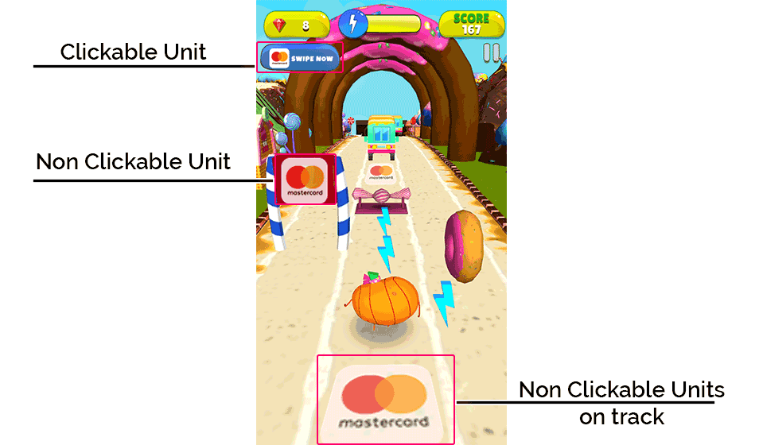

# Getting Started

This guide is for developers who 

1. Want to monetize an app or a game with Native Ads

2. Want to add a single SDK to add multiple demand partners for Native Ads i.e. mediation platform for Native Ads

3. Want to automate CTR optimization through GreedyGame’s Recommendation Engine.

###What are native ads
With Native Ads, a developer can determine the exact look, feel, size and location of ads. Native ads can be
added in accordance with the app design and user journey. You can also decide how the user reacts to each ad on click. Since native ads do not look out-of-place or break the user journey unlike banner ads and interstitial ads,hence they yield better CTRs.

<iframe width="640" height="400"
src="https://www.youtube.com/embed/el6S5jNA2sY">
</iframe>

<!-- New Content -->

### What is Mediation?
Ad mediation is an app monetization solution that lets app and game developers manage and optimize multiple ad networks in one place, with just one SDK integration. Ad mediation platforms give multiple ad networks access to an app’s inventory, creating an arena in which ad networks must compete for their ad to be served. Higher competition among ad networks means competitive CPMs and more ad revenue.

###What is GreedyGame’s Recommendation Engine?
Unlike other Native SDKs, GreedyGame does not require developers to hardcode the ad template. You need to create a transparent placeholder where GreedyGame’s Recommendation Engine supplies an ad-template and updates it Over-The-Air based on the ad performance to improve CTR over time.

### Prerequisites

1. We support PlayServices V16 only

2. Recommended: Create a [GreedyGame account](http://publisher.greedygame.com/) and register an app/game.

<!-- New Content End -->

<!-- 

###What to keep in mind while integrating?

##1. Where should I add units in my app?
Priority to add ad units in various game screens should be in the following order - `Gameplay -> Main Menu -> Exit Screen -> Other Screens. `

##2. Does the position of the ad-unit matter in the screen?
The positioning of the ad unit also impacts the CPMs. The ad unit should be placed in closer proximity to action buttons within the game if clickable and within the central cross axis of the game if non-clickable in property. Example: placing the button as another tile in a menu screen. Ads that blend in more naturally within the game UI are more likely to be clicked by the users.

##3. How many ad units should I add?
We recommend adding a minimum of 2 and a maximum of 10 units within any game. Using more than 10 units results in game lags as GreedyGame SDK downloads assets for all units every time an ad refresh is called.

##4. What can be the maximum unit dimensions?
Unit sizes should fit the size of your app’s HUD. Ideally, units should not be more than `1000*1000` px.

##5. What do I need to keep in mind when creating an ad-unit?
Please create a square/rectangle transparent unit. While setting the unit up, do let us know the exact position and size on the screen where you want the ad to show. This helps us debug the units.

##6. Do I need to create the frame of the ad-unit?
No, do not provide a frame. Only create a square/rectangle transparent unit. The json (frame) is created dynamically. The assets for the frame are downloaded when an ad refresh is called. The frame is optimized and updated by our team basis the data collected to improve click-through-rates. A transparent unit helps us change the frame on the fly. If you provide a frame, we’d require to update the SDK every time any unit optimization needs to be done. 

##7. Where properties of an ad-unit can I control?
After adding a unit, you can control the following properties - 

* clickable/non-clickable property. Any units clickability can be changed anytime. 
* On/off. Any unit can be removed from the app.

These properties can be controlled through the integration panel.

##7. Can I create units which are non-clickable and show ads on them?
Yes, you can but currently, the fill for it individually is very low. We’d recommend a small clickable unit be used in conjugation with it. This way, we can show multiple elements of the same ad across a set of units (clickable and a non-clickable) thus increasing the Click-through-rates on the ad impression.

##8. How are impressions counted?
Impressions are counted when a user clicks on a native ad-unit and a window (User-initiated Interstitial) opens up which covers 75% of the screen. This is in policy with Admob Native Advanced policies.

##9. How are clicks counted?
Clicks are counted when a user clicks on an element within User-Initiated interstitial.

##10. Why do I need to add a unit nickname? 
Setting the ad unit’s nickname will help you to recognize your units easily. For your reference units ids are also mentioned against each unit.

###Do’s and Don’ts

##Unit too small

	
	

##Units should not cover game elements/ each other

	
	

##Only non-clickable unit present

	 

	
 
 

##Place units close to HUD

	
	

###Here are some inspirations for native ads - 

	
	
	
	
	
	

### Creating Units

* Always try to create the units with the recommended ratios. 1:1, 2:1, 4:1, 4:3
* Try to place multiple placements on all the scenes to help the users engage in the brand which will result into better click ratio. -->

