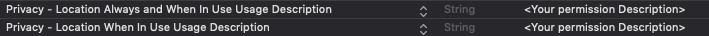
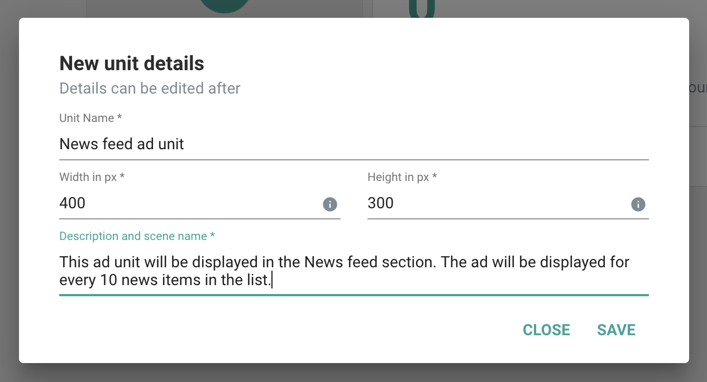

# **iOS SDK 8.8.x**
In this section we are going to see how to integrate GreedyGame Native Ads in iOS native projects.

### **Importing GreedyGame Native Ads SDK**

Apps built with Xcode can easily integrate with <a target="_blank" rel="noopener noreferrer" href="https://cocoapods.org/">Cocoapods</a> or Manually.

**CocoaPod:**

To integrate GreedyGame SDK into your Xcode project using <a target="_blank" rel="noopener noreferrer" href="https://cocoapods.org/">Cocoapods</a>, specify it in your Podfile:

If you are building with `XCode 10` or `XCode 10.1`,

```
  source 'https://github.com/GreedyGame/cocoapod-folio.git'   
  use_frameworks!

  target <Your Target Name> do
     pod ‘GreedyGameSDK’, ‘1.0.4’
  end
```

If you are building with `XCode 10.2`, `XCode 10.2.1`

```
  source 'https://github.com/GreedyGame/cocoapod-folio.git'   
  use_frameworks!

  target <Your Target Name> do
      pod ‘GreedyGameSDK’, ‘1.0.4.1’
  end
```
**Manual installation:**

If you are building with `XCode 10` or `XCode 10.1`,

 <a target="_blank" rel="noopener noreferrer" href="https://github.com/GreedyGame/ios-native-plugin/archive/1.0.4.zip" class="pure-material-button-contained">Download SDK For XCode 10 and 10.1</a>

If you are building with `XCode 10.2`, `XCode 10.2.1`

  <a target="_blank" rel="noopener noreferrer" href="https://github.com/GreedyGame/ios-native-plugin/archive/1.0.4.1.zip" class="pure-material-button-contained">Download SDK For XCode 10.2 and 10.2.1</a>

 * Unzip and then add the `greedygame.framework`, `commons.framework` and `imageProcessing.framework` into your project.
 * Add these 3 frameworks under `Embedded Binaries` section in General or Build Phases.

### **Adding Permissions**

GreedyGame SDK needs the following permissions to work with.

**Mandatory permissions**

 * Add `App Transport Security Settings` in your project plist file.
 * Then make `Allow Arbitary Loads` to `YES`.

 

**Optional permissions**     


 Add any one of the location permission depends upon your requirement.We prefer to set `Privacy-Location When In Use Usage Description`
 in plist file.


 


!!! tip
    Location permission will help improving the revenue because of better ad targeting.

### **Creating Ad Units**
Adunits are ad assets that are rendered as a native component to the app.

**Follow the below steps to create an Ad Unit ID.**

* Goto **<a target="_blank" rel="noopener noreferrer" href="https://integration.greedygame.com">Integration Panel</a>**
* Select an App you have created previously.
* Click on **`Create Unit`** inside the **`Ad units in app`** Card.
* Enter all the fields and click **`Save`**.



Follow the same procedure to create multiple Ad Units inside the app.

!!! note ""
    Best practices about the Unit Dimensions can be found under **<a target="_blank" rel="noopener noreferrer" href="/best_practices/#creating-units">Best Practices</a>** section.
    

### **Import GreedyGame Framework**

```Swift tab=

  import greedygame

```

```Objective-c tab="Objective - C"

  #import <greedygame/greedygame.h>

```

### **CampaignStateListener methods**

Extend the `CampaignStateListener` to the corresponding viewcontroller which receives callback of the ad.


| Methods      | Definition                                      |
| ------------ | ----------------------------------------------- |
| `onAvailable(campaignId: String)`  | SDK fetched an ad|
| `onUnavailable()`    | Failed to fetch next ad                          |
| `onError(error: String)`     | SDK not able to initialize. Check the `error` message.|

### **Initializing GreedyGameAgent**

`GreedyGameAgent` is the entry point to fetching Native Ads from GreedyGame SDK. Create `GreedyGameAgent` instance in the `viewDidLoad` of the ViewController.

```Swift tab=
  let greedyGameAgent = GreedyGameAgent.Builder()
                       	.setGameId(App_ID_CREATED) //e.g 00100100
                        .addUnit(ADUNIT_CREATED) //e.g unit-1000
                      	.addUnit(ADUNIT_CREATED) //e.g float-1000
                        .stateListener(self)
                      	.build()
```

```Objective-c tab="Objective - C"

 // Create GreedyGameAgent property in .h file

  @property(nonatomic, strong)GreedyGameAgent *greedyGameAgent;


 // Add the below code under ViewDidLoad function in .m file

  Builder *builder = [[Builder alloc]init];
  [builder setGameId:APP_ID_CREATED]; //e.g 00100100
  [builder addUnit:ADUNIT_CREATED]; //e.g unit-1000
  [builder addUnit:ADUNIT_CREATED]; //e.g float-1000
  [builder stateListener:self];

  self.greedyGameAgent = builder.build;

```
### **Custom Rendering Native Ads**
Custom rendering allows you to render Native Ads by fetching the image's local path and rendering it with your own `ImageView`.Follow the example to do the same.

  * Create/add an `imageview` either programmatically or using storyboard and enable the `UserInteractionEnabled` property.
  * Add the tap gesture to the imageview to show interstitial.

**To fetch the Ad**

To fetch the Ad for a unit you need to call `getPath(unitId)` in `GreedyGameAgent` instance.


```Swift tab= 
//Create imageview in viewDidLoad method if you create an imageView programmatically.
let imageView = UIImageView(frame: IMAGE_SIZE) 

if let path = greedyGameAgent?.getPath(unitId: ADUNIT_CREATED) {  
	// GreedyGameAgent has an ad that can be rendered for this Unit id. 
   imageView1.image = UIImage(contentsOfFile: path)
} else {
	// GreedyGame does not have a valid Ad for this Unit id at the moment
}
```

```Objective-C tab="Objective-c"
UIImageView *imageView = [[UIImageView alloc]initWithFrame: IMAGE_SIZE]; // AdUnit ImageView to render ad
// Game logics

NSString *path = [self.greedyGameAgent getPathWithUnitId:ADUNIT_CREATED];
    
if (path.length != 0){
	// GreedyGameAgent has an ad that can be rendered for this Unit id. 
    self.imageView1.image = [UIImage imageWithContentsOfFile:path];
}else{
	// GreedyGame does not have a valid Ad for this Unit id at the moment
}
```

!!! warning
    
    It's the publisher responsibility to call `getPath(unitId)` at relevant places to render the ads. For example, in `onAvailable()` callback of the `CampaignStateListener` and when you are changing the `Activity` or `Scene` calling `getPath(unitId)` at the start of the scene will help you resolve

	
**Show user initiated interstitial**

call `showUII(unitId:)`  inside the respective tap gesture action method to open the interstitial.

```Swift tab=
    greedyGameAgent?.showUII(unitId: ADUNIT_CREATED)
```

```Objective-C tab="Objective-c"
	[self.greedyGameAgent showUIIWithUnitId: ADUNIT_CREATED];
```

## **Load an Ad**
To load Native Ads call the `intialize()` method from `GreedyGameAgent` instance created before.

```Swift tab= hl_lines="6"
  let greedyGameAgent = GreedyGameAgent.Builder()
                       	.setGameId(App_ID_CREATED) //e.g 00100100
                        .addUnit(ADUNIT_CREATED) //e.g unit-1000
                        ---"other builder methods"---
                      	.build()
  greedyGameAgent.initialize()
```

```Objective-C tab="Objective-C" hl_lines="7"
  Builder *builder = [[Builder alloc]init];
  [builder setGameId:GAME_ID_CREATED]; //e.g 00100100
  [builder addUnit:ADUNIT_CREATED]; //e.g slot-1000
  ---"other builder methods"---
  self.greedyGameAgent = builder.build;

  [self.greedyGameAgent initialize];
```

!!! tip "When to load the GreedyGame's Native Ad?"
    Load the ads by calling `greedyGameAgent.initialize()` as early as possible to get the benefits of getting an Ad early. An ideal place would be to call this on `ViewDidLoad()` method of the first `ViewController` of the game.

Once `initialize()` method called GreedyGame SDK will fetch ads directly from GreedyGame's demand or it will fetch from any of the Mediation's enabled.

<!-- 
## **Destroy Ads**

When you are done with the ads and do not want to display it call `destroy()` on `GreedyGameAgent` instance.

```Swift tab=
  GreedyGameAgent.destroy()
```

```Objective-C tab="Objective-C"
  [self.GreedyGameAgent destroy];
```

Detroying ads will automatically remove the Ads created with `NativeAdView`. You can also register for Ad destroy events by extending the `AdDestroyListener` and register the `AdDestroyListener` before `load()` the SDK like below

```Swift tab=
  GreedyGameAgent.setAdDestroyListener(self)
```

```Objective-C tab="Objective-C"
  [self.GreedyGameAgent setAdDestroyListener:self];
```

You can get the destroy callback by conforming `destroy()` method in the corresponding `ViewController` which extends the `AdDestroyListener`

```Swift tab=
  func Destroy() {

  }
```

```Objective-C tab="Objective-C"
  -(void)Destroy{
    
  }
```
 -->


### **Refresh Ads**

You should refresh the ads that are shown, during natural pauses in your gameflow. Typical examples would include the game pause menu, user trying to restart a level or move to another level, death of a character etc. This will help maximise your revenue and also blend in seamlessly to the gamer. GreedyGame SDK by default doesn’t refresh the ads in between a session. For this you need to call the following API.

```Swift tab=
greedyGameAgent.refresh()
```

```Objective-C tab="Objective-C"
[self.greedyGameAgent refresh];
```

This will give a callback at the same CampaignStateListener set earlier and the flow would happen as earlier. The units should be properly updated on both `onAvailable()` and `onUnavailable()` callbacks.

!!! warning

    There is a 60 second minimum threshold applied to this API. This means that if this API gets called again within 60 seconds of the previous call, it is ignored.


## **Admob Mediation support**
GreedyGame SDK can source Ads from GreedyGame directly or it can also fetch demand from `Admob` also.

To enable `Admob Mediation` call `enableAdmob(true)` on the `GreedyGameAgent.Builder` instance.

```Swift tab= hl_lines="4"
  let greedyGameAgent = GreedyGameAgent.Builder()
                       	.setGameId(GAME_ID_CREATED) //e.g 00100100
                        .addUnit(ADUNIT_CREATED) //e.g slot-1000
                        .enableAdmob(true)
                        ---"other builder methods"---
                      	.build()
  greedyGameAgent.initialize()
```

```Objective-C tab="Objective-C" hl_lines="4"
  Builder *builder = [[Builder alloc]init];
  [builder setGameId:GAME_ID_CREATED]; //e.g 00100100
  [builder addUnit:ADUNIT_CREATED]; //e.g unit-1000
  [builder enableAdmob:YES];
  ---"other builder methods"---
  self.greedyGameAgent = builder.build;

  [self.greedyGameAgent initialize];
```

## **Compliance with GDPR**
To enable GDPR privacy settings for GreedyGame's Native iOS SDK you can create the instance of `PrivacyOptions` and passing it to `GreedyGameAgent` instance before calling `initialize()`.

```Swift tab=
let privacyOptions = PrivacyOptions()
privacyOptions.setNpa(npa: true)
greedyGameAgent?.setPrivacyOptions(privacyOpt: privacyOptions)
greedyGameAgent.initialize()
```

```Objective-C tab="Objective-C"
PrivacyOptions *privateOptions = [[PrivacyOptions alloc]init];
[privateOptions setNpaWithNpa:YES];
[self.greedyGameAgent setPrivacyOptionsWithPrivacyOpt:privateOptions];
[self.greedyGameAgent initialize];
```

!!! note
    Load GreedyGameAgent only after the user has given the consent. If `initialize()` is called before receiving the consent then the current app session will be considered with the consent of using privacy information. 

    Admob's SDK will also receive the Consent passed from you in case if you are using `Admob Mediation`.

## **Compliance with COPPA**

To enable COPPA filter in GreedyGame's Native iOS SDK you can call the method `enableCoppa(true)` in `GreedyGameAgent.Builder` instance.

```Swift tab= hl_lines="4"
  let greedyGameAgent = GreedyGameAgent.Builder()
                       	.setGameId(GAME_ID_CREATED) //e.g 00100100
                        .addUnit(ADUNIT_CREATED)    //e.g unit-1000
                        .enableCoppa(true)
                        ---"other builder methods"---
                      	.build()
  greedyGameAgent.load()
```

```Objective-C tab="Objective-C" hl_lines="4"
  Builder *builder = [[Builder alloc]init];
  [builder setGameId:GAME_ID_CREATED]; //e.g 00100100
  [builder addUnit:ADUNIT_CREATED]; //e.g slot-1000
  [builder enableCoppa:YES];
  ---"other builder methods"---
  self.greedyGameAgent = builder.build;

  [self.greedyGameAgent initialize];
```

## **Test Ads**

Now you have successfully integrated with GreedyGame Native Ads now is the time to test the integration.

GreedyGame recommends an easy way to test the ads by following the below steps

* Goto **<a target="_blank" rel="noopener noreferrer" href="https://integration.greedygame.com">Integration Panel</a>**
* Select an App in which you want to check the test ads.
* Click `SCAN QR` under the test Ads section and follow the stpes mentioned to get the test ads.

## **Going Live**

You have successfully integrated GreedyGame SDK and verified the testing flow with Test Ads section. Now follow the below steps to start earning revenue.

* Goto **<a target="_blank" rel="noopener noreferrer" href="https://integration.greedygame.com">Integration Panel</a>**
* Select the App which you want to make `Live`.
* Click  `GO LIVE` under Publish section and you will get a message  `Your request has been received and live traffic will be started in 48 hours`.
* You will start making money once the status changes to `APP IS LIVE` under publish section.

!!! warning
    you have gone live do not click on the production ads for testing. Always go to the **Test Ads** section and Test your integration.

    

!!! Important "Remove simulator architecture from greedygame SDK"
    Greedygame SDK has simulator architecture.You need to remove this architecture by <a target="_blank" rel="noopener noreferrer" href="https://github.com/GreedyGame/ios-native-plugin">add the script</a> under `Note` section as run script in build phases.


