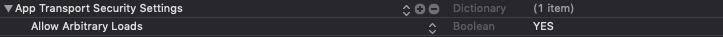
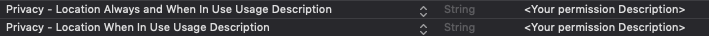
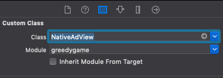
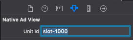

# **iOS**
In this section we are going to see how to integrate GreedyGame Native Ads in iOS native projects.

### **Importing GreedyGame Native Ads SDK**

Apps built with Xcode can easily integrate with <a target="_blank" rel="noopener noreferrer" href="https://cocoapods.org/">Cocoapods</a> or Manually.

**CocoaPod:**

To integrate GreedyGame SDK into your Xcode project using <a target="_blank" rel="noopener noreferrer" href="https://cocoapods.org/">Cocoapods</a>, specify it in your Podfile:

If you are building with `XCode 10` or `XCode 10.1`,

```
  source 'https://github.com/GreedyGame/cocoapod-folio.git'   
  use_frameworks!

  target <Your Target Name> do
	   pod ‘GreedyGameSDK’, ‘0.2.0.0.1’
  end
```

If you are building with `XCode 10.2`,

```
  source 'https://github.com/GreedyGame/cocoapod-folio.git'   
  use_frameworks!

  target <Your Target Name> do
     pod ‘GreedyGameSDK’, ‘0.2.0.0.2’
  end
```


**Manual installation:**

If you are building with `XCode 10` or `XCode 10.1`,

 <a target="_blank" rel="noopener noreferrer" href="https://github.com/GreedyGame/ios-native-plugin/releases/tag/b2.0.0.1" class="pure-material-button-contained">Download GreedyGame SDK For XCode 10 and 10.1</a>

If you are building with `XCode 10.2`,

  <a target="_blank" rel="noopener noreferrer" href="https://github.com/GreedyGame/ios-native-plugin/releases/tag/b2.0.0.2" class="pure-material-button-contained">Download GreedyGame SDK For XCode 10.2</a>

 * Click `Source code (zip)` to download GreedyGame SDK.
 * Unzip and then add the `greedygame.framework`, `commons.framework` and `imageProcessing.framework` into your project.
 * Add these 3 frameworks under `Embedded Binaries` section in General or Build Phases.

### **Adding Permissions**

GreedyGame SDK needs the following permissions to work with.

**Mandatory permissions**

 * Add `App Transport Security Settings` in your project plist file.
 * Then make `Allow Arbitary Loads` to `YES`.

 

**Optional permissions**     


 Add any one of the location permission depends upon your requirement.We prefer to set `Privacy-Location When In Use Usage Description`
 in plist file.


 


!!! tip
    Location permission will help improving the revenue because of better ad targeting.


### **Creating Ad Units**
Adunits are ad assets that are rendered as a native component to the app.

**Follow the below steps to create an Ad Unit ID.**

* Goto **<a target="_blank" rel="noopener noreferrer" href="https://integration-v2.greedygame.com">Integration Panel</a>**
* Select an App you have created previously.
* Click on **`Create Unit`** inside the **`Ad units in app`** Card.
* Enter all the fields and click **`Save`**.


Follow the same procedure to create multiple Ad Units inside the app.

!!! note ""
    Best practices about the Unit Dimensions can be found under **<a target="_blank" rel="noopener noreferrer" href="/best_practices/#creating-units">Best Practices</a>** section.

    
### **Import GreedyGame Framework**

```Swift tab=

  import greedygame

```

```Objective-c tab="Objective - C"

  #import <greedygame/greedygame.h>

```

### **AdListener methods**

Extend the `AdListener` to the corresponding viewcontroller which receives callback of the ad.


| Methods      | Definition                                      |
| ------------ | ----------------------------------------------- |
| `onAvailable(adId: String)`  | SDK fetched an ad|
| `onUnavailable()`    | Failed to fetch next ad                          |
| `onError(error: String)`     | SDK not able to initialize. Check the `error` message.|

### **Initializing GreedyGameAds**

`GreedyGameAds` is the entry point to fetching Native Ads from GreedyGame SDK. Create `GreedyGameAds` instance in the `viewDidLoad` of the ViewController.

```Swift tab=
  let greedyGameAds = GreedyGameAds.Builder()
                       	.appId(App_ID_CREATED) //e.g 00100100
                        .addUnitId(ADUNIT_CREATED) //e.g slot-1000
                      	.addUnitId(ADUNIT_CREATED) //e.g slot-1000
                        .withAdListener(self)
                      	.build()
```

```Objective-c tab="Objective - C"

 // Create GreedyGameAds property in .h file

  @property(nonatomic, strong)GreedyGameAds *greedyGameAds;


 // Add the below code under ViewDidLoad function in .m file

  Builder *builder = [[Builder alloc]init];
  [builder appId:APP_ID_CREATED]; //e.g 00100100
  [builder addUnitId:ADUNIT_CREATED]; //e.g slot-1000
  [builder addUnitId:ADUNIT_CREATED]; //e.g slot-1000
  [builder withAdListener:self];

  self.greedyGameAds = builder.build;

```

### **Rendering Native Ads**

To render Native Ads add the the `NativeAdView` as a subview of any of the view in ViewController to show Native Ads.
Add the below code in `ViewDidAppear` method.

```Swift tab=
  let nativeAdView = NativeAdView(frame: <View Size>)
  nativeAdView.unitId = ADUNIT_CREATED
  self.view.addSubview(nativeAdView)
```

```Objective-C tab="Objective-c"
  NativeAdView *nativeAdView = [[NativeAdView alloc]initWithFrame:<View Size>];
  nativeAdView.unitId = ADUNIT_CREATED;
  [self.view addSubview:nativeAdView];
```

!!! Note
    Instead of `self.view` you can use your respective view to show the ad.
     
<!-- Also you can add NativeAdView directly to the UIView in storyBoard.By simply assign the NativeAdView Class in Identitiy Inspector instead of UIView.

* Add the UIView into the storyBoard.

* Go to Identity inspector at the right side pane.Change the UIView class to NativeAdView.
	 	

* Go to Attributes inspector enter the unit for the view and add the adUnitId in the unit Id box.
			 -->

!!! info
    The advantage of integrating GreedyGame Native Ads is that we handle Ads refresh based on the value **`Refresh time`** set in the Integration Panels **`Edit Game`** section. Also, by integrating via `NativeAdView` GreedyGame sdk handles `Click` and `Applying Ads` itself. 	

## **Load an Ad**
To load Native Ads call the `load()` method from `GreedyGameAds` instance created before.

```Swift tab= hl_lines="6"
  let greedyGameAds = GreedyGameAds.Builder()
                       	.appId(App_ID_CREATED) //e.g 00100100
                        .addUnitId(ADUNIT_CREATED) //e.g slot-1000
                        ---"other builder methods"---
                      	.build()
  greedyGameAds.load()
```

```Objective-C tab="Objective-C" hl_lines="7"
  Builder *builder = [[Builder alloc]init];
  [builder appId:GAME_ID_CREATED]; //e.g 00100100
  [builder addUnitId:ADUNIT_CREATED]; //e.g slot-1000
  ---"other builder methods"---
  self.greedyGameAds = builder.build;

  [self.greedyGameAds load];
```

!!! tip "When to load the GreedyGame's Native Ad?"
    Load the ads by calling `greedyGameAds.load()` as early as possible to get the benefits of getting an Ad early. An ideal place would be to call this on `ViewDidLoad()` method of the first `ViewController` of the game.

Once `load()` method called GreedyGame SDK will fetch ads directly from GreedyGame's demand or it will fetch from any of the Mediation's enabled.

## **Destroy Ads**

When you are done with the ads and do not want to display it call `destroy()` on `GreedyGameAds` instance.

```Swift tab=
  greedyGameAds.destroy()
```

```Objective-C tab="Objective-C"
  [self.greedyGameAds destroy];
```

Detroying ads will automatically remove the Ads created with `NativeAdView`. You can also register for Ad destroy events by extending the `AdDestroyListener` and register the `AdDestroyListener` before `load()` the SDK like below

```Swift tab=
  greedyGameAds.setAdDestroyListener(self)
```

```Objective-C tab="Objective-C"
  [self.greedyGameAds setAdDestroyListener:self];
```

You can get the destroy callback by conforming `destroy()` method in the corresponding `ViewController` which extends the `AdDestroyListener`

```Swift tab=
  func Destroy() {

  }
```

```Objective-C tab="Objective-C"
  -(void)Destroy{
    
  }
```

## **Admob Mediation support**
GreedyGame SDK can source Ads from GreedyGame directly or it can also fetch demand from `Admob` also.

To enable `Admob Mediation` call `enableAdmob(true)` on the `GreedyGameAds.Builder` instance.

```Swift tab= hl_lines="4"
  let greedyGameAds = GreedyGameAds.Builder()
                       	.appId(GAME_ID_CREATED) //e.g 00100100
                        .addUnitId(ADUNIT_CREATED) //e.g slot-1000
                        .enableAdmob(true)
                        ---"other builder methods"---
                      	.build()
  greedyGameAds.load()
```

```Objective-C tab="Objective-C" hl_lines="4"
  Builder *builder = [[Builder alloc]init];
  [builder appId:GAME_ID_CREATED]; //e.g 00100100
  [builder addUnitId:ADUNIT_CREATED]; //e.g slot-1000
  [builder enableAdmob:YES];
  ---"other builder methods"---
  self.greedyGameAds = builder.build;

  [self.greedyGameAds load];
```

## **Compliance with GDPR**
To enable GDPR privacy settings for GreedyGame's Native iOS SDK you can create the instance of `PrivacyOptions` and passing it to `GreedyGameAds` instance before calling `load()`.

```Swift tab=
  // User has given a consent to protect their privacy
  let privacyOption = PrivacyOptions();
  privacyOption.setNpa(npa: true) // By passing true means that the User has given consent to protect their privacy.
  greedyGameAds.withPrivacyOptions(privacyOpt: privacyOption)

  greedyGameAds.load()
```

```Objective-C tab="Objective-C"
  PrivacyOptions *privacyOption = [[PrivacyOptions alloc]init];
  [privacyOption setNpaWithNpa:YES]; // By passing YES means that the User has given consent to protect their privacy.
  [self.greedyGameAds setPrivacyOptionsWithPrivacyOpt:privacyOption];

  [self.greedyGameAds load];
```

!!! note
    Load GreedyGameAds only after the user has given the consent. If `load()` is called before receiving the consent then the current app session will be considered with the consent of using privacy information. 

    Admob's SDK will also receive the Consent passed from you in case if you are using `Admob Mediation`.

## **Compliance with COPPA**

To enable COPPA filter in GreedyGame's Native iOS SDK you can call the method `enableCoppa(true)` in `GreedyGameAds.Builder` instance.

```Swift tab= hl_lines="4"
  let greedyGameAds = GreedyGameAds.Builder()
                       	.appId(GAME_ID_CREATED) //e.g 00100100
                        .addUnitId(ADUNIT_CREATED) //e.g slot-1000
                        .enableCoppa(true)
                        ---"other builder methods"---
                      	.build()
  greedyGameAds.load()
```

```Objective-C tab="Objective-C" hl_lines="4"
  Builder *builder = [[Builder alloc]init];
  [builder appId:GAME_ID_CREATED]; //e.g 00100100
  [builder addUnitId:ADUNIT_CREATED]; //e.g slot-1000
  [builder enableCoppa:YES];
  ---"other builder methods"---
  self.greedyGameAds = builder.build;

  [self.greedyGameAds load];
```

## **Test Ads**

Now you have successfully integrated with GreedyGame Native Ads now is the time to test the integration.

GreedyGame recommends an easy way to test the ads by following the below steps

* Goto **<a target="_blank" rel="noopener noreferrer" href="https://integration-v2.greedygame.com">Integration Panel</a>**
* Select an App in which you want to check the test ads.
* Click `SCAN QR` under the test Ads section and follow the stpes mentioned to get the test ads.

## **Going Live**

You have successfully integrated GreedyGame SDK and verified the testing flow with Test Ads section. Now follow the below steps to start earning revenue.

* Goto **<a target="_blank" rel="noopener noreferrer" href="https://integration-v2.greedygame.com">Integration Panel</a>**
* Select the App which you want to make `Live`.
* Click  `GO LIVE` under Publish section and you will get a message  `Your request has been received and live traffic will be started in 48 hours`.
* You will start making money once the status changes to `APP IS LIVE` under publish section.

!!! warning
    you have gone live do not click on the production ads for testing. Always go to the **Test Ads** section and Test your integration.

    

!!! Important "Remove simulator architecture from greedygame SDK"
    Greedygame SDK has simulator architecture.You need to remove this architecture by <a target="_blank" rel="noopener noreferrer" href="https://github.com/GreedyGame/ios-native-plugin">add the script</a> under `Note` section as run script in build phases.
