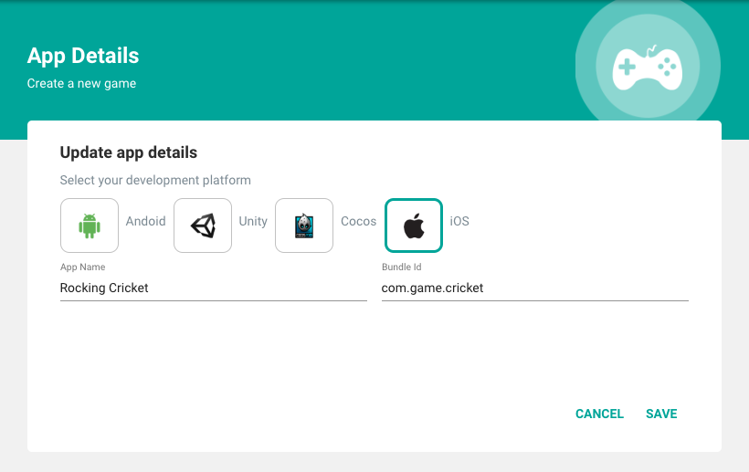

# **iOS**
In this section we are going to see how to integrate GreedyGame Native Ads in iOS native projects.

### **Importing GreedyGame Native Ads SDK**

Games built with Xcode can easily integrate with Cocoapod or Manually.

**CocoaPod:**

To integrate GreedyGame SDK into your Xcode project using CocoaPods, specify it in your Podfile:

```
  source 'https://github.com/GreedyGame/cocoapod-folio.git'   
  use_frameworks!

  target <Your Target Name> do
	pod ‘GreedyGameSDK’, ‘~>1.0.0’
  end
```

**Manual installation:**

 <a target="_blank" rel="noopener noreferrer" href="https://github.com/GreedyGame/ios-native-plugin/releases/tag/1.0.1" class="pure-material-button-contained">Download GreedyGame SDK</a>

 * Click `Source code (zip)` to download GreedyGame SDK.
 * Unzip and then add the `greedygame.framework`, `commons.framework` and `imageProcessing.framework` into your project.
 * Add these 3 frameworks under `Embedded Binaries` section in General or Build Phases.

### **Adding Permissions**

GreedyGame SDK needs the following permissions to work with.

**Mandatory permissions**

 * Add `App Transport Security Settings` in your project plist file.
 * Then make `Allow Arbitary Loads` to `YES`.

 

**Optional permissions**     


 Add any one of the location permission depends upon your requirement.We prefer to set `Privacy-Location When In Use Usage Description`
 in plist file.


 


!!! tip
    Location permission will help improving the revenue because of better ad targeting.

### **Creating Game ID**
Game ID is an unique identifier for your game.

**Follow the below steps to create a Game ID.**

* Goto [https://integration.greedygame.com](https://integration.greedygame.com).
* Login with your GreedyGame's Publisher account.
* Click on **`Games`** menu from the side nav.
* Click on the **`Add Game`** button from the popup model.
* Select the **`iOS`** Platform.
* Enter **`Game name`** and **`Bundle Id`** of the game.
* Click on **`SAVE`**.




Once the game is successfully created you will be taken to `Game Details` page where you can see the game related metrics like `Ad requests`, `Impression` and `Clicks`.

### **Creating Ad Units**
Adunits are ad assets that are rendered as a native component to the game.

**Follow the below steps to create an Ad Unit ID.**

* Goto **[Integration panel](https://integration.greedygame.com)**.
* Select a Game you have created previously.
* Click on **`Create Unit`** inside the **`Ad units in game`** Card.
* Enter all the fields and click **`Save`**.


Follow the same procedure to create multiple Ad Units inside the game.

!!! note ""
    Best practices about the Unit Dimensions can be found under **[Best Practices](http://127.0.0.1:8000/best_practices/)** section.

### **Import GreedyGame Framework**

```Swift tab=

  import greedygame

```

```Objective-c tab="Objective - C"

  #import <greedygame/greedygame.h>

```

### **AdListener methods**

Extend the `AdListener` to the corresponding viewcontroller which receives callback of the ad.


| Methods      | Definition                                      |
| ------------ | ----------------------------------------------- |
| `onAvailable(adId: String)`  | SDK fetched an ad|
| `onUnavailable()`    | Failed to fetch next ad                          |
| `onError(error: String)`     | SDK not able to initialize. Check the `error` message.|

### **Initializing GreedyGameAds**

`GreedyGameAds` is the entry point to fetching Native Ads from GreedyGame SDK. Create `GreedyGameAds` instance in the `viewDidLoad` of the ViewController.

```Swift tab=
  let greedyGameAds = GreedyGameAds.Builder()
                       	.appId(GAME_ID_CREATED) //e.g 00100100
                        .addUnitId(ADUNIT_CREATED) //e.g slot-1000
                      	.addUnitId(ADUNIT_CREATED) //e.g slot-1000
                        .withAdListener(self)
                      	.build()
```

```Objective-c tab="Objective - C"

 // Create GreedyGameAds property in .h file

  @property(nonatomic, strong)GreedyGameAds *greedyGameAds;


 // Add the below code under ViewDidLoad function in .m file

  Builder *builder = [[Builder alloc]init];
  [builder appId:GAME_ID_CREATED]; //e.g 00100100
  [builder addUnitId:ADUNIT_CREATED]; //e.g slot-1000
  [builder addUnitId:ADUNIT_CREATED]; //e.g slot-1000
  [builder withAdListener:self];

  self.greedyGameAds = builder.build;

```

### **Rendering Native Ads**

To render Native Ads set the the `NativeAdView` class in  any of the view in Viewcontroller in which you want to show Native Ads.

```Swift tab=
  let nativeAdView = NativeAdView(frame: <View Size>)
  nativeAdView.adUnit = ADUNIT_CREATED
  self.view.addSubview(nativeAdView)
```

```Objective-C tab="Objective-c"
  NativeAdView *nativeAdView = [[NativeAdView alloc]initWithFrame:<View Size>];
  nativeAdView.adUnit = ADUNIT_CREATED;
  [self.view addSubview:nativeAdView];
```

Also you can add NativeAdView directly to the UIView in storyBoard.By simply assign the NativeAdView Class in Identitiy Inspector instead of UIView.

* Add the UIView into the storyBoard.

* Go to Identity inspector at the right side pane.Change the UIView class to NativeAdView.
	 	

* Go to Attributes inspector enter the unit for the view and add the adUnitId in the unit Id box.
			

!!! info
    The advantage of integrating GreedyGame Native Ads is that we handle Ads refresh based on the value **`Refresh time`** set in the Integration Panels **`Edit Game`** section. Also, by integrating via `NativeAdView` GreedyGame sdk handles `Click` and `Applying Ads` itself. 	

## **Load an Ad**
To load Native Ads call the `load()` method from `GreedyGameAds` instance created before.

```Swift tab= hl_lines="6"
  let greedyGameAds = GreedyGameAds.Builder()
                       	.appId(GAME_ID_CREATED) //e.g 00100100
                        .addUnitId(ADUNIT_CREATED) //e.g slot-1000
                        ---"other builder methods"---
                      	.build()
  greedyGameAds.load()
```

```Objective-C tab="Objective-C" hl_lines="7"
  Builder *builder = [[Builder alloc]init];
  [builder appId:GAME_ID_CREATED]; //e.g 00100100
  [builder addUnitId:ADUNIT_CREATED]; //e.g slot-1000
  ---"other builder methods"---
  self.greedyGameAds = builder.build;

  [self.greedyGameAds load];
```

!!! tip "When to load the GreedyGame's Native Ad?"
    Load the ads by calling `greedyGameAds.load()` as early as possible to get the benefits of getting an Ad early. An ideal place would be to call this on `ViewDidLoad()` method of the first viewcontroller of the game.

Once `load()` method called GreedyGame SDK will fetch ads directly from GreedyGame's demand or it will fetch from any of the Mediation's enabled.

## **Destroy Ads**

When you are done with the ads and do not want to display it call `destroy()` on `GreedyGameAds` instance.

```Swift tab=
  self.greedyGameAds.destroy()
```

```Objective-C tab="Objective-C"
  [self.greedyGameAds destroy];
```

Detroying ads will automatically remove the Ads created with `NativeAdView`. You can also register for Ad destroy events by extending the `AdDestroyListener`

```Swift tab=
  greedyGameAds.setAdDestroyListener(self)
```

```Objective-C tab="Objective-C"
  [self.greedyGameAds setAdDestroyListener:self];
```

You can get the destroy callback by conforming `destroy()` method in the corresponding viewController which extends the `AdDestroyListener`

```Swift tab=
  func Destroy() {

  }
```

```Objective-C tab="Objective-C"
  -(void)Destroy{
    
  }
```

## **Admob Mediation support**
GreedyGame SDK can source Ads from GreedyGame directly or it can also fetch demand from `Admob` also.

To enable `Admob Mediation` call `enableAdmob(true)` on the `GreedyGameAds.Builder` instance.

```Swift tab= hl_lines="4"
  let greedyGameAds = GreedyGameAds.Builder()
                       	.appId(GAME_ID_CREATED) //e.g 00100100
                        .addUnitId(ADUNIT_CREATED) //e.g slot-1000
                        .enableAdmob(true)
                        ---"other builder methods"---
                      	.build()
  greedyGameAds.load()
```

```Objective-C tab="Objective-C" hl_lines="4"
  Builder *builder = [[Builder alloc]init];
  [builder appId:GAME_ID_CREATED]; //e.g 00100100
  [builder addUnitId:ADUNIT_CREATED]; //e.g slot-1000
  [builder enableAdmob:YES];
  ---"other builder methods"---
  self.greedyGameAds = builder.build;

  [self.greedyGameAds load];
```

## **Compliance with GDPR**
To enable GDPR privacy settings for GreedyGame's Native Android SDK you can create the instance of `PrivacyOptions` and passing it to `GreedyGameAds` instance before calling `load()`.

```Swift tab=
  // User has given a consent to protect their privacy
  let privacyOption = PrivacyOptions();
  privacyOption.setNpa(npa: true) // By passing true means that the User has given consent to protect their privacy.
  greedyGameAds.withPrivacyOptions(privacyOpt: privacyOption)

  greedyGameAds.load()
```

```Objective-C tab="Objective-C"
  PrivacyOptions *privacyOption = [[PrivacyOptions alloc]init];
  [privacyOption setNpaWithNpa:YES]; // By passing YES means that the User has given consent to protect their privacy.
  [self.greedyGameAds setPrivacyOptionsWithPrivacyOpt:privacyOption];

  [self.greedyGameAds load];
```

!!! note
    Load GreedyGameAds only after the user has given the consent. If `load()` is called before receiving the consent then the current app session will be considered with the consent of using privacy information. 

    Admob's SDK will also receive the Consent passed from you in case if you are using `Admob Mediation`.

## **Compliance with COPPA**

To enable COPPA filter in GreedyGame's Native Android SDK you can call the method `enableCoppa(true)` in `GreedyGameAds.Builder` instance.

```Swift tab= hl_lines="4"
  let greedyGameAds = GreedyGameAds.Builder()
                       	.appId(GAME_ID_CREATED) //e.g 00100100
                        .addUnitId(ADUNIT_CREATED) //e.g slot-1000
                        .enableCoppa(true)
                        ---"other builder methods"---
                      	.build()
  greedyGameAds.load()
```

```Objective-C tab="Objective-C" hl_lines="4"
  Builder *builder = [[Builder alloc]init];
  [builder appId:GAME_ID_CREATED]; //e.g 00100100
  [builder addUnitId:ADUNIT_CREATED]; //e.g slot-1000
  [builder enableCoppa:YES];
  ---"other builder methods"---
  self.greedyGameAds = builder.build;

  [self.greedyGameAds load];
```

## **Test Ads**

Now you have successfully integrated with GreedyGame Native Ads now is the time to test the integration.

GreedyGame recommends an easy way to test the ads by following the steps in [Test Ads]("https://integration-v2.greedylab.com/test-ads").
