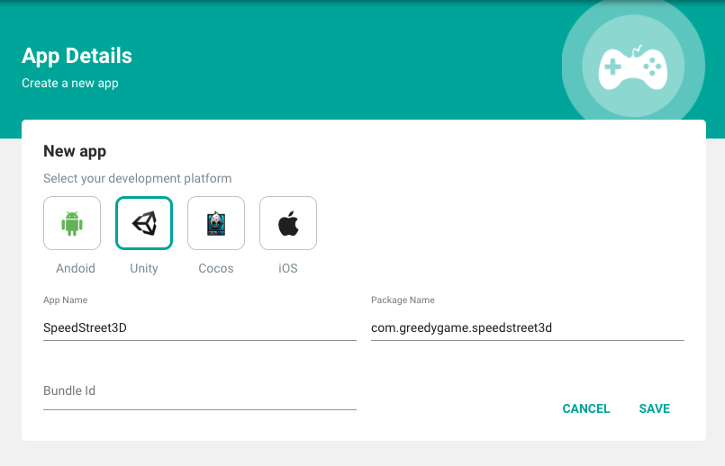
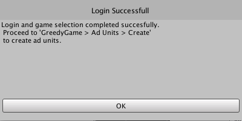

We will guide you through the steps involved in integrating GreedyGame SDK in Unity using the GreedyGame Plugin.

### **Update your AndroidManifest.xml**

Add the following `<activity>` declaration inside `<application>` tag of the Manifest.
```xml hl_lines="6"
<activity
    android:name="com.greedygame.android.core.campaign.uii.GreedyGameActivity"
    android:configChanges="keyboardHidden|orientation|screenSize|screenLayout|layoutDirection"
    android:hardwareAccelerated="true"
    android:launchMode="singleTask"
    android:screenOrientation="portrait"
    android:theme="@style/Theme.GGTransparent">
</activity>
```

Also, note the highlighted line where you can change the orientation of the `screenOrientation` property based on which orientation you want to open the engagment. All the allowed values can be found in <a target="_blank" rel="noopener noreferrer" href="https://developer.android.com/guide/topics/manifest/activity-element#screen">Android Documentation</a>.

### **Adding Permissions**

GreedyGame SDK needs the following permissions to work with.

**Mandatory permissions**

```xml
<uses-permission android:name="android.permission.ACCESS_NETWORK_STATE"/>
<uses-permission android:name="android.permission.ACCESS_WIFI_STATE"/>
<uses-permission android:name="android.permission.INTERNET"/>
```

**Optional permissions**

```xml
<uses-permission android:name="android.permission.ACCESS_COARSE_LOCATION"/>
<uses-permission android:name="android.permission.WRITE_EXTERNAL_STORAGE"/>
```

!!! tip
    `ACCESS_COARSE_LOCATION` permission will help improving the revenue because of doing better ad targetting.

### **Creating Game ID**
Game ID is an unique identifier for your game.

**Follow the below steps to create a Game ID.**

* Goto **<a target="_blank" rel="noopener noreferrer" href="https://integration-v2.greedygame.com">Integration Panel</a>**
* Login with your GreedyGame's Publisher account.
* Click on **`Apps`** menu from the side nav.
* Click on the **`Create new app`** button from the popup model.
* Select the **`Unity`** Platform.
* Enter **`App name`** and **`Package name`** of the game.
* Click on **`SAVE`**.



Once the game is successfully created you will be taken to `Game Details` page where you can see the game related metrics like `Ad requests`, `Impression` and `Clicks`. 

### **Importing GreedyGame Native Ads SDK For Unity**

Download the GreedyGame Unity SDK  

<a target="_blank" rel="noopener noreferrer" href="https://github.com/GreedyGame/unity-plugin/releases/" class="pure-material-button-contained">Download Plugin</a>

**Import Unity Package Inside current-sdk folder** 
Open the downloaded SDK folder from github. Go to 'current-sdk' folder and import the package to unity. 
Assets > Import > Import Custom Package

!!! note ""
    Make sure you have atleast one scene added to your Build Settings before proceeding to the next step.


### **Import Google Mobile Ads SDK for Unity**
If you don't have Google Mobile Ads SDK for Unity already integrated download it <a target="_blank" rel="noopener noreferrer" href="https://github.com/googleads/googleads-mobile-unity/releases/latest">here</a>.
Import the package **Assets > Import > Import Custom Package**.
Google Mobile Ads SDK is a mandatory requirement for GreedyGame SDK.


### **Login to GreedyGame Panel**
After importing the package you should be able to see GreedyGame menu in the top menu bar. 
Go to **GreedyGame > Account**


Enter the credentials and press login. You'll be prompted with a dialog box as shown below if the game is identified from the package details given while creating the game.


!!! note ""
    If in case you don't get the above popup select the game from the drop down menu and press confirm.

Once you select the game, the details would be fetched and you will see a pop-up as shown below.




### **Creating Ad Units**
Adunits are ad assets that are rendered as native components inside the game. 
There are two kinds of unit that you can create
GameObject : These are the units that are added to the 3d-world of your game.
UI Object : These units are UI componenets which are always rendered at a certain position on the screen.

Go to **GreedyGame > Ad Units > Create** menu in the top bar.


**Furnish the details**

* Choose Scene : Select the scene in which you want to create the unit.
* Name : A unique name to identify the ad unit. eg. MainMenuSquareAd, race_scene_wall_unit etc
* Aspect Ratio : Aspect in which you want the unit to be created.
* Dimension : Based on aspect you can choose 3 different sizes for your unit. Small, Optimum, Large.
* Type of Ad : GameObject / UI Object
* Default Texture : In case no ads are available this is the texture that would be shown on the game object. You can choose any default texture you like. Just make sure that the dimensions/ ratios are matching else the image will appear stretched

!!! tip
    **Dimension** : Try to keep the pixel size less than 600 in either dimensions as larger dimensions can result in performance issues.

Once you click on **Create**, a unit will be created and added to the scene. You will be shown a popup as shown below.


In your scene heirarchy you can see the unit created as shown below. 
!!! note ""
    The name given at the time of unit creation is the game object name as well.


You can now adjust the size rotation etc of the created game object to place it at the exact position you want. Follow the same procedure to add multiple ad units.


### **Generate Initialization Code**
Once you have completed creating the ad units go to **GreedyGame > Build** 


If the scene is not saved yet it will prompt you to save the scene. Click on Generate Initialization again and the initialization code will be generated for you and you will get a popup as shown below.


You can see the generated initialization prefab (**GGInitializationPrefab**) in the scene heirarchy as shown below.


!!! tip
    The Initialization prefab is always attached to the very first scene in your game's build settings. In case you want to add it to another scene copy the prefab and use it in whichever scene you wish to initialize the sdk. Also make sure that you don't add multiple initialization prefabs inside your game. 

## **Test Ads**

Now you have successfully integrated with GreedyGame Native Ads now is the time to test the integration.

GreedyGame recommends an easy way to test the ads by following the steps in <a target="_blank" rel="noopener noreferrer" href="https://integration-v2.greedygame.com/verify">Test Ads</a>.